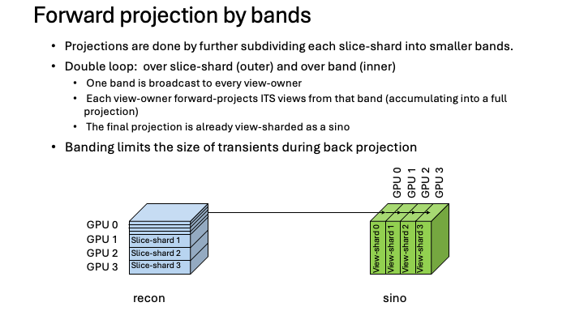
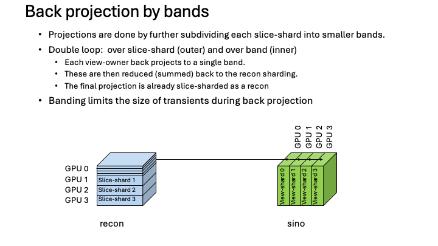

.. _ShardingOverview:

=================
Sharding Overview
=================

This page describes how MBIRJAX spreads a single reconstruction across several
devices.  It is a developer-oriented overview of the architecture -- enough to
follow how the pieces fit together and where they live in the code, not a
line-by-line specification.  For the user-facing view (how to turn it on and
control it), see :doc:`usr_multi_gpu`.

**Scope.**  Sharding runs within a single process across the available devices
(multiple GPUs, or, with no GPU, multiple CPU devices).  It works for every
geometry and for the QGGMRF denoiser.  A key invariant is that the **result is
independent of the number of devices**: when a count does not divide evenly the
data is zero-padded to equal shares and the padding is kept exactly inert.
Multi-node execution is out of scope.

The two shardings
-----------------

MBIRJAX shards the two large arrays along complementary axes:

* the **reconstruction is sharded by slice** -- each device (a *slice-owner*)
  holds a contiguous band of slices of the voxel cylinders,
  ``(num_pixels, slices_per_device)``;
* the **sinogram is sharded by view** -- each device (a *view-owner*) holds a
  block of views and is responsible for producing *all* detector rows for those
  views.

.. figure:: figs/sharding-structure.png
   :width: 90%
   :align: center

   The recon is sharded by slice (left); the sinogram by view (right).  Every
   slice-shard must reach every view-shard, so projection is an all-to-all
   between the two layouts.

Because the two arrays are sharded on different axes, projecting between them is
an all-to-all: every slice-shard contributes to every view-shard, and vice
versa.  To bound both the inter-device communication and the peak per-device
memory, the projectors **work one slice-shard at a time** rather than moving the
whole volume at once.

Placement: the single source of device layout
----------------------------------------------

Device layout is described by a single object, ``Placement`` (in
``mbirjax/_sharding/placement.py``).  A placement records:

* the list of ``devices``;
* which array ``axis`` is sharded;
* the ``real_size`` of that axis and the ``padded_size`` (rounded up to a
  multiple of the device count);
* its own 1-D ``mesh``.

A model carries two placements -- ``recon_placement`` (slice axis) and
``sino_placement`` (view axis) -- and these are the **single source of truth**
for where every array lives; there is no separate "main device" or "is-sharded"
state.

Automatic selection uses all available devices -- occasionally fewer, in the
unusual case where an extra device would do no useful work (the exact policy is
a tunable heuristic).  Padding is **exactly inert** (entry zero-fill, projector
output masks, and the prior-interface mask all keep it from affecting any
result), which is what makes the output independent of the device count.  For
explicit control, see :meth:`~mbirjax.TomographyModel.configure_devices`.

Forward and back projection by bands
-------------------------------------

Within a slice-shard the work is subdivided once more, into **bands** of slices.
Both projectors run a double loop: over slice-shards (outer) and over bands
(inner).  Banding bounds the size of the transient buffers that arise while
moving data between the two shardings.

   Forward projection: one band is broadcast to every view-owner, each
   view-owner forward-projects its own views from that band (accumulating), and
   the result is already a view-sharded sinogram.

**Forward projection** (recon → sinogram) broadcasts each band to every
view-owner; each view-owner forward-projects its own views from that band and
accumulates into its part of the sinogram.  When the loop finishes, the sinogram
is already in the view-sharded layout.

   Back projection: each view-owner back-projects to a single band; the
   contributions are reduced (summed) over views into the recon's slice
   sharding.

**Back projection** (sinogram → recon) is the adjoint: each view-owner
back-projects into a band, and the per-view contributions are reduced (summed)
and scattered into the slice-owner that holds those slices -- a reduce-scatter.
The result is already in the slice-sharded recon layout.

Why cone beam projects whole cylinders
--------------------------------------

In parallel-beam geometry detector row ``r`` maps only to slice ``r`` with no
cross-row mixing, so a device can produce just the slices a destination needs by
first slicing its sinogram views to those rows -- the transient cylinder buffer
can be held at one destination's slice range.

Cone beam cannot do this cheaply: magnification maps a single slice to a
*data-dependent band* of detector rows (dependent on the cone angle and the
particular slice), so the slice and detector-row axes are
coupled.  This projection could proceed one band of slices at a time, but
then each detector row requires multiple updates from a single voxel cylinder.
Alternatively, each view owner can collect all the bands for a batch of pixels
and then project the resulting full cylinders.  A/B tests on representative
shapes showed that the second approach increased transient memory for the
projector by about 10% but decreased time by about 2x.

A view-owner therefore collects the **full voxel cylinder** once and
then projects the full cylinder, rather than restricting the computation
to a band up front.  This coupling is also why the sinogram is sharded
by view (not by detector row) uniformly across geometries.

The QGGMRF prior and halos
--------------------------

The QGGMRF prior is local: each voxel interacts only with its neighbors.  Across
slices that means a slice-owner can evaluate the prior on its own band entirely
locally **except** at the boundary between two adjacent slice-shards, where it
needs the neighbor's boundary slice.  Those boundary slices are exchanged as
**halos** between neighboring owners.  At the outer edge of the volume there is
no neighbor, so the boundary condition is reflection; a single shard (one
device) is reflected at both edges and needs no halos at all
(``_extract_halos`` / ``_stage_halos`` in ``tomography_model.py``).

Halo staging happens host-side and so cannot live inside a JIT, which drives the
single- vs multi-device split below.

Single- and multi-device paths
-------------------------------

The prior-bearing loops (the VCD reconstruction and the denoiser) take one of
two paths depending on the device count:

* **One device** -- the whole sweep compiles into a single JIT.  A single shard
  is reflected at both edges, so no halos are needed and there is no Python-level
  loop.
* **Several devices** -- a Python loop runs the passes, staging the halos
  host-side once per pass (the part that cannot be jitted), and the on-device
  per-pass work stays compiled.

Both paths converge to the same result; only the boundary handling and the loop
structure differ.

A related platform split exists for cone-beam back projection: the GPU
single-device case uses a rolled-pixel kernel
(``back_project_one_view_to_pixel_batch``), while CPU and the multi-device
reduce-scatter use a band kernel (``back_project_one_view_to_band``).  The two
kernels have opposite platform rankings, so the driver selects by platform.

Multi-device execution: thread pools
------------------------------------

The steps above all share a common substrate: run a kernel on each device, then
combine the per-device outputs into one sharded array.  Within a single step the
per-device kernels are independent (each device works on its own shard or band);
the cross-device communication -- the broadcast in forward projection, the
reduce-scatter in back projection -- happens *between* steps, not inside them.
The design problem is to launch those per-device kernels and reassemble their
outputs **without bouncing data through host memory**, which the obvious
approaches on GPU fail to do (they pay host-transfer cost or hit
hardware-portability problems).

MBIRJAX uses a **thread pool with one worker per device**: each thread reads its
shard in place (``addressable_shards`` -- the data is already resident on that
device, so there is no host copy), runs the per-device kernel on its device, and
keeps its result on-device.  The per-device results are reassembled into one
logically global, sharded ``jax.Array`` with
``jax.make_array_from_single_device_arrays`` -- with **no host round-trip in
either direction** (``device_pool`` / ``run_per_device`` / ``assemble_sharded``
in ``mbirjax/_sharding/thread_execution.py``).

The table below summarizes the approaches that were measured (full study with
timings on H100, L40S, and CPU in
``experiments/sharding/parallel_performance/fbp_filter_parallelism_comparison.md``):

.. list-table::
   :header-rows: 1
   :widths: 30 25 25 20

   * - Approach
     - Host (PCIe) transfer
     - Correctness
     - Verdict
   * - **Thread pool, fully on-device**
     - none
     - correct on all hardware tested
     - **used** (≈2× on 2 GPUs)
   * - ``shard_map`` (SPMD)
     - none
     - wrong on L40S (cause unknown); correct on H100
     - not hardware-safe
   * - Threads, gather through host
     - fixed cost, independent of device count
     - correct
     - dominated by transfer
   * - ``pmap``
     - --
     - --
     - deprecated

The thread-pool approach was chosen because it transfers nothing through host
memory, is correct on every device tested, and produces output already in the
sharded layout the next step expects.  ``shard_map`` is a viable future upgrade
(slightly faster on H100) if the L40S correctness discrepancy is ever diagnosed.

Where this lives in the code
-----------------------------

* ``mbirjax/_sharding/placement.py`` -- the ``Placement`` object and array
  movement.
* ``mbirjax/_sharding/thread_execution.py`` -- the thread-pool execution helpers.
* the per-geometry projector kernels (e.g. ``back_project_one_view_to_band``) in
  ``parallel_beam.py`` / ``cone_beam.py`` / ``translation_model.py`` /
  ``multiaxis_parallel.py``.
* ``denoising.py`` -- the single-/multi-device denoiser paths.

The strongest correctness gate for the inert-padding invariant is the
*poison-the-padding* test: a forward projection of a recon whose padded slices
are *nonzero* must bit-match the clean-padded forward.  Results are also checked
against a single-device reference and across device counts.
